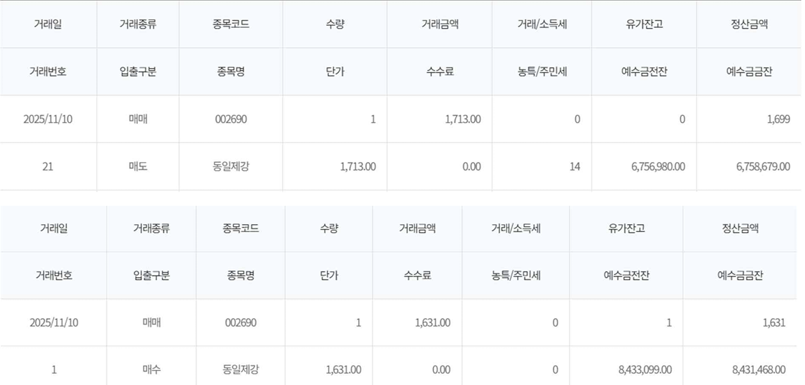
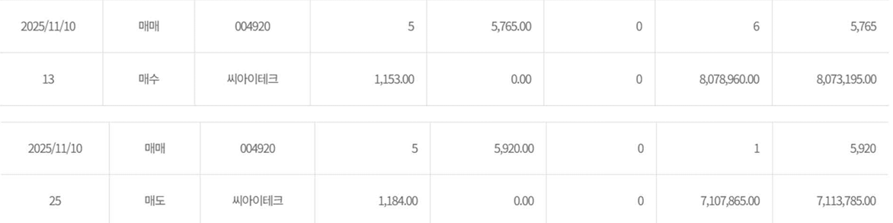
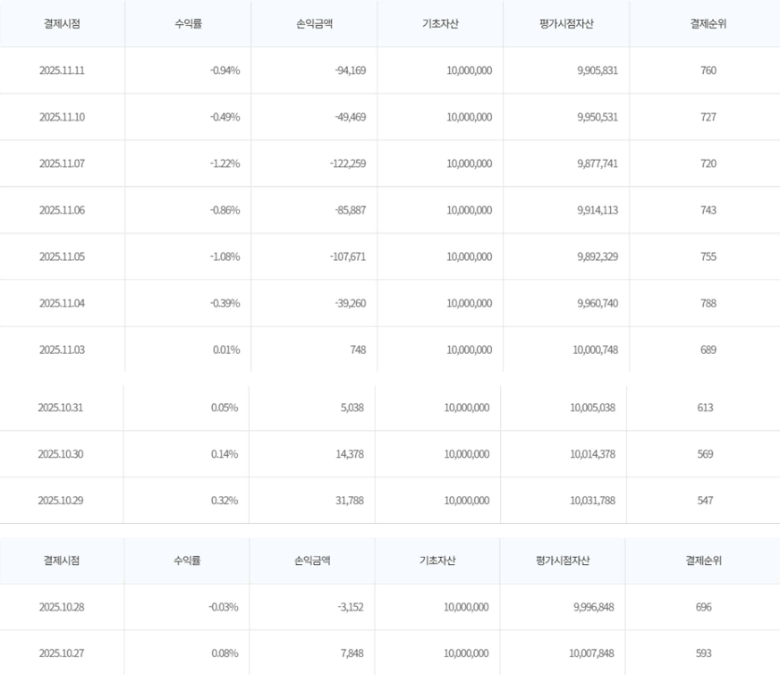

# 한국투자증권 API 기반 자동매매 시스템

**작성자:** 오진석  
**Python :** 3.13.5 (3.10 이상 권장)  

---

## 🧩 프로젝트 개요

이 프로젝트는 **한국투자증권 오픈API**를 활용하여  
국내 주식의 실시간 시세를 수신하고,  
지정된 **매수 조건**, **익절·손절 기준**에 따라  
자동으로 주문을 수행하는 **모의투자 자동매매 시스템**입니다.

>  주요 목표
> - 장 시작전 후보종목군을 선정
> - 실시간 체결 데이터(WebSocket) 수신  
> - 매매 조건(익절/손절) 자동 판단
> - 매매 상태(positions.json) 자동 저장 및 복구

---


## Installation
**1. 패키지 설치**
```bash
pip install -r requirements.txt
```
**2. info.yaml 설정**   
config의 info.yaml을 열어 **본인의 한투 OpenAPI 정보**를 아래 예시처럼 입력
```bash
env: paper      
appkey: "본인 앱키 입력"
appsecret: "본인 앱시크릿 입력"
acc_no: "본인 계좌번호 입력"
domain:
  paper:
    rest: "https://openapivts.koreainvestment.com:29443"
    ws: "ws://ops.koreainvestment.com:31000"
  real:
    rest: "https://openapi.koreainvestment.com:9443"
    ws: "ws://ops.koreainvestment.com:21000"
trading:
  k: 0.5
  take_profit: 0.05
  stop_loss: 0.03
  max_symbols: 30

```
**3. 매수 후보 종목 생성**   
장 시작전, 다음 명령어로 매수 후보 종목(candidates.json) 파일을 생성
```bash
cd core
python -m api.screener
```

**4. 자동매매 시스템 실행**   
```bash
python -m main
```

## 📁 폴더 구조

```bash
v1_auto_project/
│
├── core/
│   ├── main.py                 # 프로그램 실행 진입점
│   │
│   ├── api/
│   │   ├── auth.py             # 인증 토큰 발급, info.yaml 로드
│   │   ├── ohlcv.py            # 일봉(OHLCV) 데이터 수집
│   │   ├── order.py            # 주문(매수/매도) 관련 로직
│   │   └── screener.py         # 매수 후보(candidates) 선별 로직
│   │
│   ├── ws/
│   │   ├── websocket_loop.py   # 실시간 체결(WebSocket) 수신
│   │   ├── trade_logic.py      # 실시간 매매 로직 (익절/손절 판단)
│   │   └── utils.py            # WebSocket 및 매매 관련 유틸 함수
│   │
│   ├── prepare/
│   │   ├── state_manager.py    # 포지션(positions.json) 관리
│   │   ├── candidate_manager.py# 후보종목(candidates.json) 관리
│   │   └── kospy_list.py       # KOSPI 종목 리스트 관리
│   │
│   └── data/
│       ├── positions.json      # 현재 포지션 상태 저장
│       ├── candidates.json     # 최근 선별된 매수 후보 저장
│       ├── kospi_data.csv      # KOSPI 종목 정보 데이터
│       └── order_log.txt       # 주문 내역 로그 (실행 기록)
│
├── info.yaml                   # API 키, 계좌번호, 환경 설정 파일
├── requirements.txt            # 필요한 패키지 목록
└── README.md                   # 사용 설명서 (본 문서)
```

## 테스트 환경 및 설정

| 항목 | 내용 |
|------|------|
| API 환경 | 한국투자증권 Open API (모의투자 환경) |
| 주문 방식 | REST API (`/uapi/domestic-stock/v1/trading/order-cash`) |
| 실시간 체결 데이터 | WebSocket (`H0STCNT0`) 기반 |
| 매매 전략 | 변동성 돌파 전략 (k = 0.5) |
| 익절 / 손절 조건 | +5% / –3% |
| 매수 수량 | 기본 1~5주 (테스트용) |
| 감시 종목 수 | 20개 (후보 종목군에서 20개 추출) |
| 자동 청산 시점 | 오후 15시 20분 (장 마감) |
| 포지션 관리 파일 | `core/data/positions.json` |
| 주문 로그 파일 | `core/data/order_log.txt` |

---

##  자동 매매 결과

- `order_log.txt` 로그  
  → 로그상의 **0원은 시장가 주문 체결**을 의미한다.

- 실제 모의투자 거래 내역
  
 동일제강의 주가가 목표가(+5%)에 도달하자 자동으로 매도 주문을 실행하였으며, 1,631 -> 1,713원으로 약 5%의 이익 실현이 이루어졌다.

---

## 자동 청산

- `order_log.txt` 로그  
  → 로그상의 **0원은 시장가 주문 체결**을 의미한다.

- 실제 모의투자 거래 내역
  
1,153원 -> 1,184원으로 약 2.7%의 상승이 있었으나 익절 / 손절 조건을 모두 만족하지 않아 장마감 시간에 청산이 이루어졌다.


## 누적 수익률

   

---